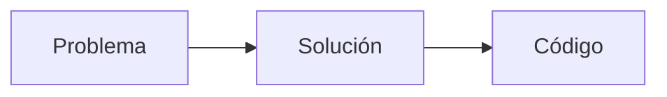
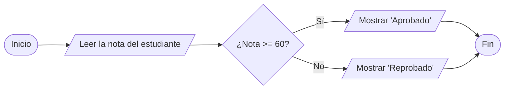
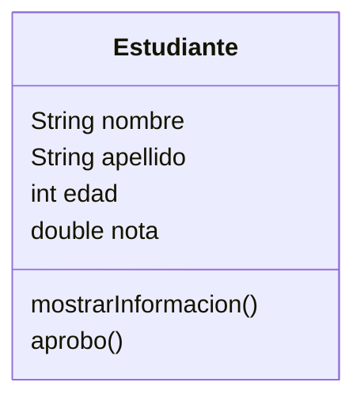
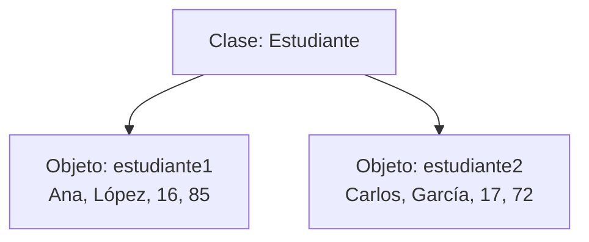

# De algoritmos a objetos
## Objetivo de la charla

Al terminar, me gustaría que un estudiante pudiera decir algo parecido a:

> “Un algoritmo es un método para resolver un problema mediante una serie de pasos **precisos, definidos y finitos**. Ese algoritmo lo podemos convertir en código y, cuando nuestros programas crecen, podemos organizar la información y el comportamiento usando clases y objetos.”

---

## 1. Introducción

### ¿Qué hace realmente un programador?

Un programador no comienza escribiendo código. Primero debe comprender un problema, pensar una solución y convertirla en instrucciones que una computadora pueda ejecutar.



---

## 2. Algoritmos

Aunque normalmente lo hacemos sin pensarlo, lavarse las manos puede describirse mediante una serie de pasos:

1. Abrir el grifo.
2. Mojarse las manos.
3. Aplicar jabón.
4. Frotarse las manos.
5. Enjuagarse las manos.
6. Cerrar el grifo.
7. Secarse las manos.

Esta serie de instrucciones puede considerarse un algoritmo porque describe, paso a paso, cómo realizar una tarea determinada.

> [!NOTE]
> Un algoritmo no depende necesariamente de un lenguaje de programación.

### ¿Qué es un algoritmo?

Un algoritmo es un método para resolver un problema mediante una serie de pasos **precisos, definidos y finitos**.

#### Preciso

Preciso significa que las instrucciones tienen que indicar claramente qué debe hacerse y en qué orden.

Las personas podemos interpretar instrucciones incompletas porque tenemos experiencia y contexto. Una computadora necesita instrucciones mucho más claras.

#### Definido

Definido significa que los pasos no deberían cambiar de significado cada vez que los ejecutamos.

#### Finito

Finito significa que debe tener un número determinado de pasos y llegar a su fin.

### Visto desde un enfoque computacional

Queremos determinar si un estudiante aprobó un curso.

> ¿Qué información necesitamos y qué pasos tendría que seguir nuestro programa?

1. Leer la nota del estudiante.
2. Comparar la nota con 60.
3. Si la nota es mayor o igual a 60: mostrar **“Aprobado”**.
4. De lo contrario: mostrar **“Reprobado”**.



---

## 3. De algoritmo a programa

Podemos convertir el algoritmo anterior en código utilizando Java:

```java
import java.util.Scanner;

public class Main {
    public static void main(String[] args) {
        Scanner sc = new Scanner(System.in);
		
        System.out.print("Ingrese su nota: ");
        int nota = sc.nextInt();
		
        if (nota >= 60) {
            System.out.println("Aprobado");
        } else {
            System.out.println("Reprobado");
        }
    }
}
```

### Relacionando el algoritmo con el código

**1. Leer la nota del estudiante:**

```java
int nota = sc.nextInt();
```

**2. Comparar la nota con 61:**

```java
if (nota >= 60) {
```

**3. Mostrar el resultado correspondiente:**

```java
System.out.println("Aprobado");
```

```java
System.out.println("Reprobado");
```

> [!NOTE]
> El lenguaje de programación nos proporciona herramientas para expresar una solución. Saber la sintaxis es importante, pero primero debemos saber qué queremos que haga el programa.

### ¿Qué ocurre cuando un programa empieza a crecer?

Hasta ahora nuestro programa es pequeño. Sin embargo, un programa real puede necesitar manejar mucha más información y realizar muchas más acciones.

---

## 4. Programación Orientada a Objetos

### ¿Por qué existe?

Una primera forma de almacenar la información podría ser la siguiente:

```java
String nombre1 = "Ana";
String apellido1 = "López";
int edad1 = 16;
double nota1 = 85;

String nombre2 = "Carlos";
String apellido2 = "García";
int edad2 = 17;
double nota2 = 72;

String nombre3 = "María";
String apellido3 = "Pérez";
int edad3 = 16;
double nota3 = 91;
```

> Esto funciona para tres estudiantes, pero ¿qué pasaría si ahora tuviéramos que manejar 500 estudiantes?

La **Programación Orientada a Objetos (POO)** es una forma de organizar un programa utilizando entidades que reúnen **información** y **comportamientos** relacionados.

Para introducirla utilizaremos cuatro conceptos:

1. **Clase**
2. **Atributos**
3. **Métodos**
4. **Objetos**

---

### Clase

Una **clase** describe cómo serán los objetos de un determinado tipo.

En nuestro ejemplo, podemos crear una clase llamada `Estudiante`:



> [!NOTE]
> La clase `Estudiante` todavía no representa a ningún estudiante en particular. Solamente describe qué información y qué comportamientos podrá tener cualquier estudiante que creemos en el programa.

---

### Atributos

Los **atributos** son las características o datos que describen a un objeto.

En nuestro estudiante tenemos:

```java
String nombre;
String apellido;
int edad;
double nota;
```

> [!TIP]
> **Atributos = lo que un objeto tiene o cómo es.**

#### Otros ejemplos

Una clase `Carro` podría tener atributos como:

```text
marca
modelo
color
velocidad
```

> Si tuviéramos una clase `Mascota`, ¿qué atributos podría tener?

---

### Métodos

Los **métodos** representan acciones o comportamientos que puede realizar un objeto.

En nuestro estudiante podemos tener:

```java
void mostrarInformacion() {
    System.out.println("Nombre: " + nombre);
    System.out.println("Apellido: " + apellido);
    System.out.println("Edad: " + edad);
    System.out.println("Nota: " + nota);
}
```

También podemos crear un método que determine si el estudiante aprobó:

```java
boolean aprobo() {
    return nota >= 61;
}
```

> [!TIP]
> **Atributos = lo que tiene.**  
> **Métodos = lo que hace.**

#### Otros ejemplos

Una clase `Carro` podría tener métodos como:

* `encender()`
* `acelerar()`
* `frenar()`

Una clase `Mascota` podría tener:

* `comer()`
* `dormir()`
* `jugar()`

---

### La clase completa

Ahora podemos juntar los atributos y los métodos dentro de una misma clase:

```java
class Estudiante {

    String nombre;
    String apellido;
    int edad;
    int nota;

    void mostrarInformacion() {
        System.out.println("Nombre: " + nombre );
        System.out.println("Apellido: " + apellido);
        System.out.println("Edad: " + edad + " años");
        System.out.println("Nota: " + nota);
    }

    boolean aprobado() {
        return nota >= 61;
    }
}
```

---

### Objeto

Una **clase** es el molde. Un **objeto** es un elemento concreto creado a partir de ese molde.

Podemos crear un estudiante específico de esta manera:

```java
Estudiante estudiante1 = new Estudiante();

estudiante1.nombre = "Ana";
estudiante1.apellido = "López";
estudiante1.edad = 16;
estudiante1.nota = 85;
```

Podemos crear otro objeto utilizando la misma clase:

```java
Estudiante estudiante2 = new Estudiante();

estudiante2.nombre = "Carlos";
estudiante2.apellido = "García";
estudiante2.edad = 17;
estudiante2.nota = 72;
```

Los dos objetos pertenecen a la misma clase, pero contienen información diferente.



### Utilizando los métodos

Una vez creado un objeto, podemos utilizar los métodos definidos en su clase:

```java
estudiante1.mostrarInformacion();

if (estudiante1.aprobado()) {
    System.out.println("El estudiante aprobó el curso");
} else {
    System.out.println("El estudiante reprobó el curso");
}
```

> [!NOTE]
> Esta es solamente una introducción a la Programación Orientada a Objetos. Existen otros conceptos importantes, pero por ahora lo fundamental es comprender la relación entre **clase, objeto, atributos y métodos**.

---

## 5. Preguntas de cierre

| #      | Pregunta                                                                                                                                                   | Opciones                                                                                                                                                                                                | Correcta | Qué evalúa                                            |
| ------ | ---------------------------------------------------------------------------------------------------------------------------------------------------------- | ------------------------------------------------------------------------------------------------------------------------------------------------------------------------------------------------------- | -------- | ----------------------------------------------------- |
| **1**  | Un algoritmo dice: <br> **1. Encender la computadora. <br> 2. Abrir el navegador. <br> 3. Volver al paso 1.** <br> ¿Cuál es su principal problema?                             | A) No usa Java <br> B) No es finito <br> C) No tiene atributos <br> D) Tiene demasiados pasos                                                                                                                    | **B**    | Entender qué significa que un algoritmo sea finito    |
| **2**  | Dos personas siguen exactamente el mismo algoritmo, pero una lo escribe en Java y otra en Python. ¿Qué debería mantenerse igual?                           | A) La sintaxis <br> B) Las instrucciones del lenguaje <br> C) La solución que intenta realizar <br> D) El nombre de las variables                                                                                | **C**    | Separar algoritmo de lenguaje de programación         |
| **3**  | Queremos un programa que diga si alguien puede entrar a una montaña rusa. ¿Qué deberíamos decidir **primero**?                                             | A) El color de la interfaz <br> B) Qué condición determina si puede entrar <br> C) Qué lenguaje usar <br> D) El nombre de la clase                                                                               | **B**    | Pensar primero en el problema y la solución           |
| **4**  | Un algoritmo dice: **“Si la nota es buena, mostrar Aprobado”**. ¿Qué problema tiene esa instrucción?                                                       | A) No es suficientemente precisa <br> B) Es demasiado finita <br> C) Necesita una clase <br> D) Debería usar un objeto                                                                                           | **A**    | Reconocer ambigüedad                                  |
| **5**  | Tenemos `nombre1`, `edad1`, `nota1`, `nombre2`, `edad2`, `nota2`… y ahora necesitamos manejar 500 estudiantes. ¿Qué problema intenta resolver la POO aquí? | A) Hacer que el programa use menos números <br> B) Agrupar información y comportamientos relacionados <br> C) Evitar completamente las variables <br> D) Hacer que Java ejecute más rápido                       | **B**    | Entender la motivación de la POO                      |
| **6**  | En una clase `Personaje`, tenemos `vida`, `nombre`, `atacar()` y `saltar()`. ¿Cuál opción contiene solo **comportamientos**?                               | A) `vida` y `nombre` <br> B) `vida` y `atacar()` <br> C) `atacar()` y `saltar()` <br> D) `nombre` y `saltar()`                                                                                                   | **C**    | Diferenciar atributos y métodos                       |
| **7**  | Tenemos una clase `Carro`. ¿Cuál de estas opciones representa mejor un **objeto** de esa clase?                                                            | A) `color` <br> B) `acelerar()` <br> C) Un Toyota Corolla negro específico <br> D) La palabra `Carro`                                                                                                            | **C**    | Aplicar clase vs. objeto a un caso nuevo              |
| **8**  | Ana y Carlos son dos objetos de la clase `Estudiante`. Si cambiamos la nota de Ana, ¿qué debería pasar con la nota de Carlos?                              | A) Cambia también <br> B) Se vuelve 0 <br> C) No cambia <br> D) Se elimina el objeto                                                                                                                             | **C**    | Comprender que los objetos tienen sus propios valores |
| **9**  | Una clase `Mascota` tiene `nombre`, `edad` y `comer()`. ¿Qué sería más lógico agregar como **método**?                                                     | A) `color` <br> B) `peso` <br> C) `dormir()` <br> D) `raza`                                                                                                                                                      | **C**    | Transferir el concepto a una situación nueva          |
| **10** | Si tenemos la clase `Videojuego`, ¿cuál sería la combinación mejor organizada?                                                                             | A) Atributo `jugar()` y método `titulo` <br> B) Atributo `titulo` y método `iniciarPartida()` <br> C) Atributo `guardar()` y método `genero` <br> D) Método `precio` y atributo `cerrar()`                       | **B**    | Razonar sobre información vs. comportamiento          |
| **11** | Ya sabemos los pasos exactos para resolver un problema. ¿Qué hacemos al convertirlos a Java?                                                               | A) Inventamos otro problema <br> B) Expresamos la solución usando la sintaxis de Java <br> C) Convertimos el algoritmo en una clase obligatoriamente <br> D) Eliminamos el algoritmo                             | **B**    | Relación algoritmo → código                           |
| **12** | ¿Cuál secuencia representa mejor el proceso explicado en la charla?                                                                                        | A) Código → problema → objeto → algoritmo <br> B) Problema → algoritmo → código → organización con clases y objetos <br> C) Clase → código → problema → algoritmo <br> D) Objeto → algoritmo → problema → código | **B**    | Integrar toda la charla                               |
