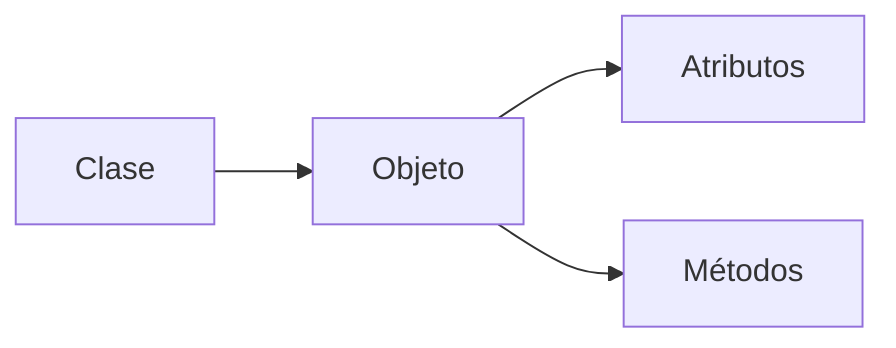
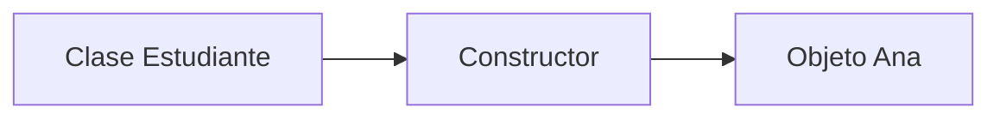
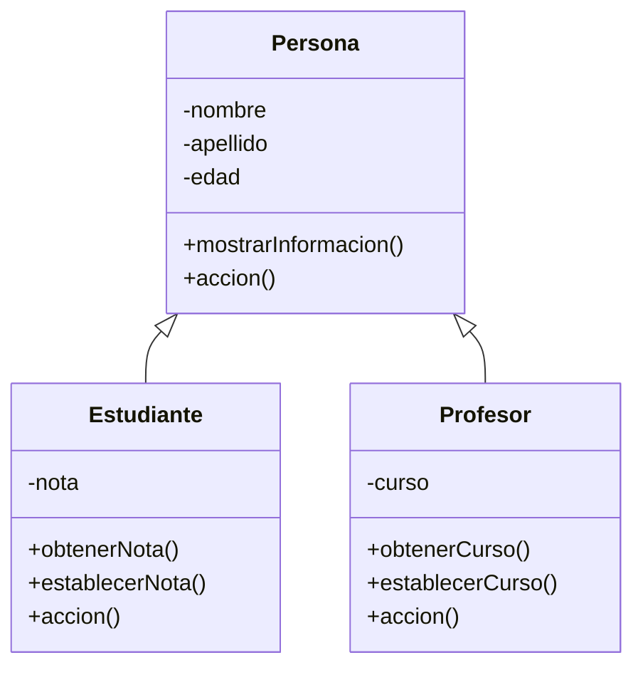
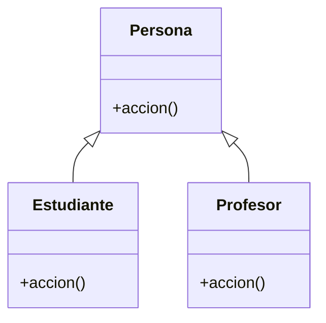

# Más allá de clases y objetos
## Objetivo de la charla

Al terminar, me gustaría que un estudiante pudiera decir algo parecido a:

> “Una clase no solo sirve para agrupar atributos y métodos. También podemos controlar cómo se crean y modifican sus objetos, reutilizar características mediante herencia y permitir que objetos relacionados se comporten de distintas maneras.”

> [!NOTE]
> La intención de esta charla **no es dominar Programación Orientada a Objetos**, sino comprender de forma intuitiva para qué existen algunos de sus conceptos más importantes.

---

## 1. Recordatorio de la charla anterior


### ¿Qué recordamos?

```java
class Estudiante {

    String nombre;
    String apellido;
    int edad;
    int nota;

    void mostrarInformacion() {
        System.out.println("Nombre: " + nombre );
        System.out.println("Apellido: " + apellido);
        System.out.println("Edad: " + edad + " años");
        System.out.println("Nota: " + nota);
    }

    boolean aprobado() {
        return nota >= 61;
    }
}

```


### La idea que ya conocemos




Posibles ideas para anticipar:

- Crear objetos de una manera más cómoda.
- Evitar que cualquiera coloque valores incorrectos en sus atributos.
- Evitar repetir código entre clases parecidas.
- Permitir que objetos similares hagan una misma acción de formas diferentes.

---

## 2. Constructores

Hasta ahora podemos crear un estudiante y después asignar sus atributos uno por uno:

```java
Estudiante estudiante1 = new Estudiante();

estudiante1.nombre = "Ana";
estudiante1.apellido = "López";
estudiante1.edad = 16;
estudiante1.nota = 85;
```


### Constructor

Un **constructor** es un bloque especial de una clase que se ejecuta cuando creamos un objeto y nos permite darle sus valores iniciales.

```java
class Estudiante {
    String nombre;
    String apellido;
    int edad;
    int nota;
	
    Estudiante(String nombre, String apellido, int edad, int nota) {
        this.nombre = nombre;
        this.apellido = apellido;
        this.edad = edad;
        this.nota = nota;
    }
}
```

Ahora podemos crear el objeto así:

```java
Estudiante estudiante1 = new Estudiante("Ana", "López", 16, 85);
```


### Comparación

Sin constructor personalizado:

```java
Estudiante estudiante1 = new Estudiante();

estudiante1.nombre = "Ana";
estudiante1.apellido = "López";
estudiante1.edad = 16;
estudiante1.nota = 85;
```

Con constructor:

```java
Estudiante estudiante1 = new Estudiante("Ana", "López", 16, 85);
```


### ¿Qué significa `this`?

`this` hace referencia al **objeto actual**.

```java
this.nombre = nombre;
```

Podemos leerlo como:

> “El atributo `nombre` de este objeto recibirá el valor que llegó en `nombre`.”

> [!NOTE]
> No es necesario profundizar demasiado en `this`. Lo importante es comprender que nos ayuda a distinguir los atributos del objeto de los valores que recibe el constructor.

### Una forma de visualizarlo



> [!NOTE]
> En Java, un constructor tiene el mismo nombre de la clase y no declara un tipo de retorno.

### Comprobación rápida


Respuesta esperada: `Carro`.

---

## 3. Encapsulamiento

Ahora tenemos objetos más fáciles de crear, pero aparece otro problema.

Supongamos que tenemos nuestro objeto `estudiante1`:

```java
estudiante1.nota = -500;
```


Otro ejemplo:

```java
estudiante1.edad = -20;
```


Hasta ahora, cualquier parte del programa puede modificar directamente los atributos del objeto.

### ¿Qué es encapsular?

**Encapsular** significa proteger la información interna de un objeto y controlar la manera en que puede consultarse o modificarse.

Una forma de hacerlo en Java es utilizando `private`:

```java
class Estudiante {
    private String nombre;
    private String apellido;
    private int edad;
    private int nota;
}
```

`private` indica que esos atributos no pueden modificarse directamente desde cualquier parte del programa.

Entonces esto dejaría de ser válido desde fuera de la clase:

```java
estudiante1.nota = -500;
```

### ¿Entonces cómo cambiamos la nota?

Podemos crear un método que establezca las reglas:

```java
public void establecerNota(int nota) {
    if (nota >= 0 && nota <= 100) {
        this.nota = nota;
    }
}
```

Ahora utilizamos:

```java
estudiante1.establecerNota(90);
```

En lugar de modificar directamente el atributo.


### Podemos informar si el valor es inválido

Así queda el método en nuestro ejemplo:

```java
public void establecerNota(int nota) {
    if (nota >= 0 && nota <= 100) {
        this.nota = nota;
    } else {
        System.out.println("La nota no es válida");
    }
}
```


### Consultar un atributo

Si necesitamos conocer la nota, podemos proporcionar un método:

```java
public int obtenerNota() {
    return nota;
}
```

Y podemos utilizarlo así:

```java
System.out.println(estudiante1.obtenerNota());
```

> [!NOTE]
> Métodos como `obtenerNota()` y `establecerNota()` suelen conocerse como **getters** y **setters**. Nos permiten controlar el acceso a la información del objeto.

### Idea principal

> **Encapsulamiento = proteger los datos y controlar cómo se utilizan.**

> [!NOTE]
> Hasta este punto seguimos trabajando con una sola clase `Estudiante`. En la siguiente sección moveremos la información que puede compartir con otras clases a una clase más general: `Persona`.

---

## 4. Herencia

Ahora imaginemos que estamos desarrollando un sistema para un colegio.

Tenemos estudiantes y profesores.


Posibles respuestas:

- Nombre.
- Apellido.
- Edad.
- Una forma de mostrar su información.
- Una acción que puede realizar cada persona.

Podríamos tener inicialmente algo parecido a esto:

```java
class Estudiante {
    private String nombre;
    private String apellido;
    private int edad;
    private int nota;
}
```

```java
class Profesor {
    private String nombre;
    private String apellido;
    private int edad;
    private String curso;
}
```


`nombre`, `apellido` y `edad` aparecen en ambas clases.

### Una clase más general

Podemos identificar que tanto `Estudiante` como `Profesor` son tipos de persona.



### ¿Qué es herencia?

La **herencia** permite crear una clase nueva a partir de otra más general y reutilizar características o comportamientos que ya existen.

En este ejemplo:

- `Persona` es la clase más general.
- `Estudiante` es un tipo de `Persona`.
- `Profesor` también es un tipo de `Persona`.

La relación se establece en Java utilizando `extends`.

### Nuestra clase `Persona`

Los datos que comparten estudiantes y profesores se trasladan a `Persona`:

```java
public class Persona {
    private String nombre;
    private String apellido;
    private int edad;

    public void accion() {
        System.out.println("Estoy realizando una acción");
    }

    public void mostrarInformacion() {
        System.out.println("Nombre: " + nombre);
        System.out.println("Apellido: " + apellido);
        System.out.println("Edad: " + edad + " años");
    }

    public void establecerNombre(String nombre) {
        this.nombre = nombre;
    }

    public void establecerApellido(String apellido) {
        this.apellido = apellido;
    }

    public void establecerEdad(int edad) {
        if (edad > 0) {
            this.edad = edad;
        } else {
            System.out.println("La edad no es válida");
        }
    }

    public String obtenerNombre() {
        return nombre;
    }

    public String obtenerApellido() {
        return apellido;
    }

    public int obtenerEdad() {
        return edad;
    }
}
```

> [!NOTE]
> Los atributos siguen siendo `private`. Las clases hijas trabajan con ellos mediante los métodos públicos que ofrece `Persona`, manteniendo el encapsulamiento que acabamos de aprender.

### `Estudiante` hereda de `Persona`

Ahora `Estudiante` ya no necesita volver a declarar `nombre`, `apellido` ni `edad`.

Solamente agrega aquello que es propio de un estudiante:

```java
public class Estudiante extends Persona {
    private int nota;

    public Estudiante(String nombre, String apellido, int edad, int nota) {
        establecerNombre(nombre);
        establecerApellido(apellido);
        establecerEdad(edad);
        establecerNota(nota);
    }

    public void establecerNota(int nota) {
        if (nota >= 0 && nota <= 100) {
            this.nota = nota;
        } else {
            System.out.println("La nota no es válida");
        }
    }

    public int obtenerNota() {
        return nota;
    }
}
```


### `Profesor` también hereda de `Persona`

`Profesor` aprovecha exactamente la misma idea:

```java
public class Profesor extends Persona {
    private String curso;

    public Profesor(String nombre, String apellido, int edad, String curso) {
        establecerNombre(nombre);
        establecerApellido(apellido);
        establecerEdad(edad);
        establecerCurso(curso);
    }

    public void establecerCurso(String curso) {
        this.curso = curso;
    }

    public String obtenerCurso() {
        return curso;
    }
}
```

### Un ejemplo muy claro de herencia

`mostrarInformacion()` está escrito únicamente en `Persona`.

Sin embargo, podemos hacer:

```java
estudiante1.mostrarInformacion();
System.out.println("Nota: " + estudiante1.obtenerNota());
```

Y también:

```java
profesor1.mostrarInformacion();
System.out.println("Curso: " + profesor1.obtenerCurso());
```


No lo escribimos nuevamente.


### ¿Qué obtiene `Estudiante`?

Como los atributos de `Persona` son privados, `Estudiante` no los modifica directamente. Lo que puede reutilizar son los métodos públicos heredados de `Persona`.

Conceptualmente podemos verlo así:

```text
Estudiante
├── mostrarInformacion()  ← Persona
├── establecerNombre()    ← Persona
├── establecerApellido()  ← Persona
├── establecerEdad()      ← Persona
├── obtenerNombre()       ← Persona
├── obtenerApellido()     ← Persona
├── obtenerEdad()         ← Persona
├── accion()              ← Persona
├── nota                  ← Estudiante
├── establecerNota()      ← Estudiante
└── obtenerNota()         ← Estudiante
```

### La pregunta “¿ES UN...?”

Una forma sencilla de reconocer una posible relación de herencia es preguntarnos:

> **¿X ES UN Y?**

Por ejemplo:

- Un estudiante **es una** persona. ✅
- Un profesor **es una** persona. ✅
- Un perro **es un** animal. ✅
- Un carro **es un** vehículo. ✅
- Una rueda **es un** carro. ❌

### “ES UN” contra “TIENE UN”

Esta diferencia puede ayudarnos a evitar relaciones incorrectas.


Un carro **tiene un** motor.


Una computadora **tiene un** teclado.

> [!NOTE]
> Cuando una cosa **tiene otra**, normalmente no estamos describiendo herencia.

### Mini actividad oral

Determinar si tendría sentido utilizar herencia:

1. `Gato` y `Animal`.
2. `Celular` y `DispositivoElectronico`.
3. `Motor` y `Carro`.
4. `Profesor` y `Persona`.
5. `Casa` y `Puerta`.

Respuestas esperadas:

1. Sí: un gato **es un** animal.
2. Sí: un celular **es un** dispositivo electrónico.
3. No: un carro **tiene un** motor.
4. Sí: un profesor **es una** persona.
5. No: una casa **tiene una** puerta.

### ¿Para qué nos sirve?


### Idea principal

> **Herencia = una clase puede aprovechar características y comportamientos de otra clase más general.**

---

## 5. Polimorfismo

El nombre puede parecer complicado, pero la idea que queremos comprender es bastante sencilla.

Imaginemos varios animales.

Todos pueden realizar una acción llamada `hacerSonido()`.

Sin embargo, no todos producen el mismo sonido.

```text
Perro → Guau
Gato  → Miau
Vaca  → Muuu
```


No necesariamente.

### Una misma acción, diferentes comportamientos

```java
class Animal {
    void hacerSonido() {
        System.out.println("El animal hace un sonido");
    }
}
```

```java
class Perro extends Animal {
    @Override
    void hacerSonido() {
        System.out.println("Guau");
    }
}
```

```java
class Gato extends Animal {
    @Override
    void hacerSonido() {
        System.out.println("Miau");
    }
}
```

> [!NOTE]
> `@Override` indica que estamos proporcionando una versión específica de un comportamiento que ya existía en la clase padre. No es necesario memorizar la anotación para comprender el concepto.

### Probemos los objetos

```java
Perro perro = new Perro();
Gato gato = new Gato();

perro.hacerSonido();
gato.hacerSonido();
```

Resultado:

```text
Guau
Miau
```

### Una misma acción, diferentes comportamientos

En `Persona` tenemos un comportamiento general:

```java
public void accion() {
    System.out.println("Estoy realizando una acción");
}
```

`Estudiante` proporciona su propia versión:

```java
@Override
public void accion() {
    System.out.println("Estoy estudiando para aprobar");
}
```

Y `Profesor` también:

```java
@Override
public void accion() {
    System.out.println("Estoy enseñando a mis estudiantes");
}
```

Resultado:

```text
Estoy estudiando para aprobar
Estoy enseñando a mis estudiantes
```


### ¿Qué es polimorfismo?

Para esta introducción podemos entenderlo como:

> **La posibilidad de utilizar una misma acción y obtener comportamientos diferentes dependiendo del objeto.**



> [!NOTE]
> En Java el polimorfismo puede aprovecharse de formas más avanzadas utilizando referencias de la clase padre. Para esta charla basta con comprender la idea observable: objetos relacionados pueden responder de manera diferente al mismo método.

### Otro ejemplo: personajes de videojuego

La misma idea podría aplicarse a distintos personajes.

Todos pueden tener:

```text
atacar()
```

Pero el resultado puede ser distinto:

```text
Guerrero → golpe con espada
Mago     → lanza un hechizo
Arquero  → dispara una flecha
```


No.

### Idea principal

> **Polimorfismo = misma acción general, distintas formas de realizarla.**

> [!TIP]
> Evitar profundizar en conceptos como enlace dinámico, tipos en tiempo de ejecución o diferencias entre sobrecarga y sobrescritura. Para esta charla basta con comprender el comportamiento observable.

---

## 6. Abstracción

Supongamos que queremos representar a un estudiante dentro de un programa.

En el mundo real podríamos conocer muchísima información sobre esa persona:

- Nombre.
- Edad.
- Nota.
- Color favorito.
- Comida favorita.
- Altura.
- Número de hermanos.
- Talla de zapatos.
- Película favorita.


Probablemente solo necesitemos algo como:

```text
Estudiante
├── nombre
└── nota
```

### ¿Qué es abstracción?

**Abstraer** significa quedarnos con las características importantes para nuestro problema e ignorar detalles que no necesitamos.


### El mismo objeto puede representarse de distintas maneras

Supongamos que queremos representar un `Carro`.

Para un videojuego de carreras quizá necesitamos:

```text
Carro
├── velocidad
├── aceleración
├── combustible
└── acelerar()
```

Pero para un sistema de venta de vehículos quizá necesitamos:

```text
Carro
├── marca
├── modelo
├── precio
└── mostrarInformacion()
```


Las dos pueden ser correctas; depende del problema que queremos resolver.


### Diferencia rápida: encapsulamiento y abstracción

Estos conceptos pueden confundirse.

| Concepto            | Pregunta sencilla                         |
| ------------------- | ----------------------------------------- |
| **Encapsulamiento** | ¿Cómo protegemos y controlamos los datos? |
| **Abstracción**     | ¿Qué información necesitamos representar? |

Ejemplo:

- Decidir que un estudiante necesita `nombre` y `nota` → **abstracción**.
- Hacer que `nota` sea `private` y validarla antes de cambiarla → **encapsulamiento**.

### Otro ejemplo

Para un videojuego podríamos representar un personaje con:

```text
Personaje
├── nombre
├── vida
├── nivel
├── atacar()
└── defender()
```

No necesitamos saber absolutamente todo sobre el personaje, solamente lo relevante para el juego.

> [!NOTE]
> Java también posee herramientas como **clases abstractas** e **interfaces**, relacionadas con el diseño orientado a objetos, pero no son necesarias para comprender esta introducción.

### Idea principal

> **Abstracción = representar lo importante y dejar fuera lo innecesario.**

---

### Así queda nuestro `Main`

Al combinar lo que hemos construido hasta ahora:

```java
public class Main {
    public static void main(String[] args) {

        Estudiante estudiante1 =
            new Estudiante("Ana", "López", 16, 85);

        Profesor profesor1 =
            new Profesor("Carlos", "García", 35, "Programación");

        System.out.println("=================================");
        System.out.println("            ESTUDIANTE");
        System.out.println("=================================");
        estudiante1.mostrarInformacion();
        System.out.println("Nota: " + estudiante1.obtenerNota());
        estudiante1.accion();

        System.out.println("");

        System.out.println("=================================");
        System.out.println("            PROFESOR");
        System.out.println("=================================");
        profesor1.mostrarInformacion();
        System.out.println("Curso: " + profesor1.obtenerCurso());
        profesor1.accion();
    }
}
```

Aquí podemos observar varias ideas de la charla trabajando juntas:

- `Estudiante` y `Profesor` reutilizan `mostrarInformacion()` mediante **herencia**.
- Los atributos están protegidos y se consultan mediante métodos, aplicando **encapsulamiento**.
- `accion()` tiene una implementación diferente en cada clase, mostrando la idea de **polimorfismo**.

---
## 7. Preguntas de cierre

| #   | Pregunta                                                                                                                                           | Opciones                                                                                                                                                                           | Correcta | Qué evalúa                               |
| --- | -------------------------------------------------------------------------------------------------------------------------------------------------- | ---------------------------------------------------------------------------------------------------------------------------------------------------------------------------------- | -------- | ---------------------------------------- |
| 1   | En una clase `Estudiante`, ¿qué representan `nombre`, `edad` y `nota`?                                                                             | A) Métodos <br> B) Atributos <br> C) Objetos <br> D) Constructores                                                                                                                 | B        | Reconocimiento de atributos              |
| 2   | ¿Para qué sirve principalmente un constructor?                                                                                                     | A) Eliminar objetos <br> B) Heredar atributos <br> C) Dar valores iniciales al crear un objeto <br> D) Proteger atributos                                                          | C        | Función de los constructores             |
| 3   | Si nuestra clase se llama `Carro`, ¿cómo se llamaría su constructor?                                                                               | A) `constructor()` <br> B) `newCarro()` <br> C) `Carro()` <br> D) `void Carro()`                                                                                                   | C        | Sintaxis básica de constructores         |
| 4   | Dentro de un constructor, ¿a qué hace referencia `this`?                                                                                           | A) A la clase padre <br> B) Al objeto actual <br> C) Al método actual <br> D) A todos los objetos                                                                                  | B        | Uso conceptual de `this`                 |
| 5   | ¿Cuál de estos valores NO tendría sentido para la nota de un estudiante?                                                                           | A) 85 <br> B) 61 <br> C) 0 <br> D) -500                                                                                                                                            | D        | Necesidad de validar datos               |
| 6   | ¿Qué busca principalmente el encapsulamiento?                                                                                                      | A) Crear más clases <br> B) Proteger los datos y controlar cómo se modifican <br> C) Hacer que todas las clases sean iguales <br> D) Eliminar métodos                              | B        | Concepto de encapsulamiento              |
| 7   | Si un atributo es `private`, ¿qué significa?                                                                                                       | A) Que desaparece <br> B) Que nadie puede usarlo nunca <br> C) Que no puede modificarse directamente desde cualquier parte del programa <br> D) Que solo acepta números            | C        | Uso básico de `private`                  |
| 8   | ¿Cuál relación representa mejor una herencia?                                                                                                      | A) Un carro tiene un motor <br> B) Una casa tiene una puerta <br> C) Un perro es un animal <br> D) Una computadora tiene un teclado                                                | C        | Identificación de relaciones de herencia |
| 9   | Completar: `class Estudiante ______ Persona`                                                                                                       | A) implements <br> B) inherits <br> C) extends <br> D) private                                                                                                                     | C        | Uso de `extends` en Java                 |
| 10  | Si `Estudiante extends Persona`, ¿qué puede aprovechar `Estudiante` de `Persona`?                                                                  | A) Nada <br> B) Características y comportamientos definidos en Persona <br> C) Solo el nombre de la clase <br> D) Únicamente constructores                                         | B        | Comprensión de la herencia               |
| 11  | ¿Cuál relación NO debería representarse mediante herencia?                                                                                         | A) Gato → Animal <br> B) Profesor → Persona <br> C) Celular → Dispositivo electrónico <br> D) Motor → Carro                                                                        | D        | Diferencia entre “ES UN” y “TIENE UN”    |
| 12  | Un `Perro` y un `Gato` tienen el método `hacerSonido()`, pero uno dice “Guau” y el otro “Miau”. ¿Qué concepto representa?                          | A) Encapsulamiento <br> B) Constructor <br> C) Polimorfismo <br> D) Abstracción                                                                                                    | C        | Identificación del polimorfismo          |
| 13  | ¿Cuál frase describe mejor el polimorfismo?                                                                                                        | A) Ocultar todos los atributos <br> B) Una misma acción puede comportarse diferente según el objeto <br> C) Una clase solo puede tener un objeto <br> D) Copiar una clase completa | B        | Comprensión conceptual del polimorfismo  |
| 14  | Para saber si un estudiante aprobó, guardamos solamente `nombre` y `nota`, ignorando su color favorito y talla de zapatos. ¿Qué estamos aplicando? | A) Herencia <br> B) Encapsulamiento <br> C) Polimorfismo <br> D) Abstracción                                                                                                       | D        | Comprensión de la abstracción            |
